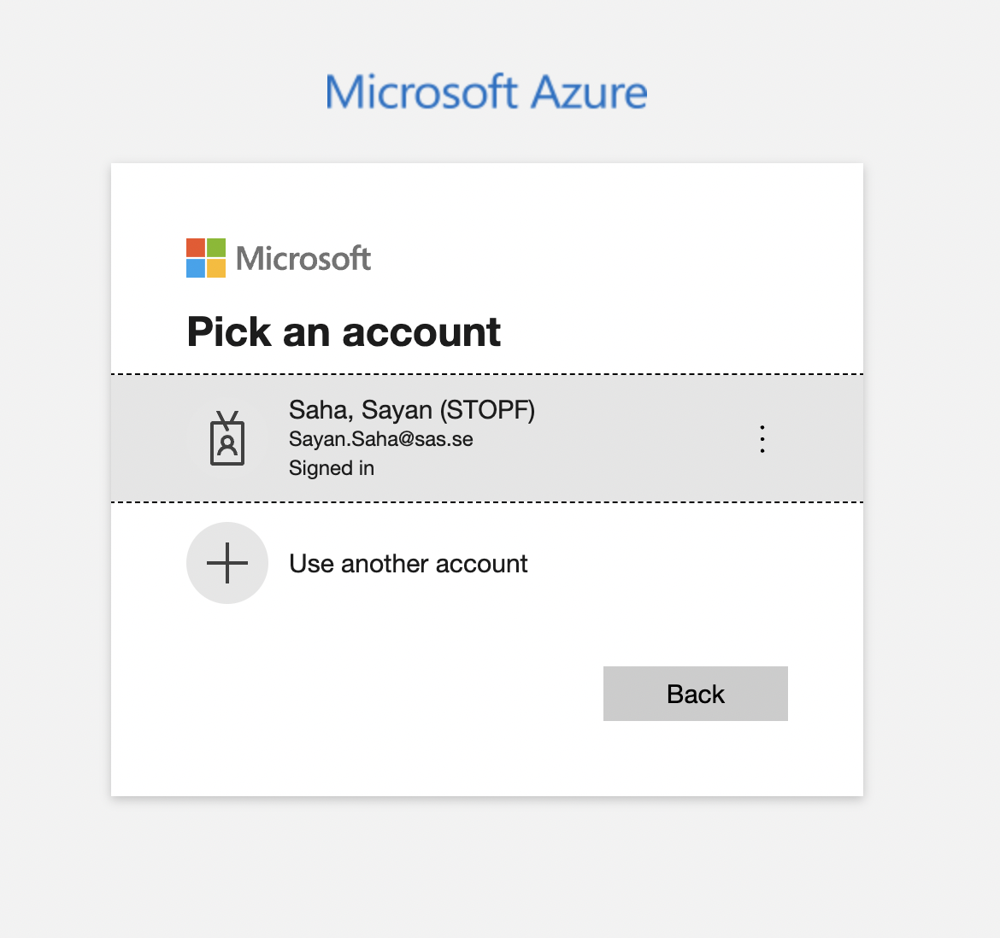
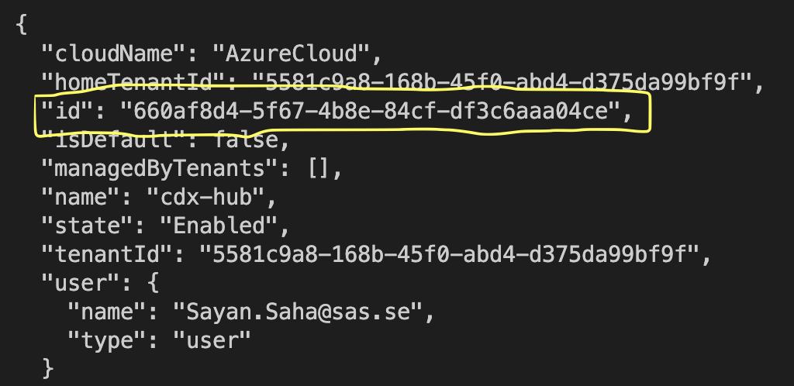

# Azure App Service Provisioning with Terraform

Simple Azure App Service provisioning with "hello-world" using Terraform. 

For more details on Terraform : https://www.terraform.io/

## What is deployed ?

* Azure Resouce Group
* Azure App Service Plan
* Azure App Service

# Setting Up Local Environment to run Terraform Code

The Infrastructure as Code Technical Deep Dive will have a follow along demo session which has a few environment pre-requisites. This document will help you setup the pre-requisites for the session. 

It guides you through:

- Installing Terraform
- Setting up Azure CLI
- Authenticating to Azure with Azure CLI commandline

You would need an Azure subscription to create resources during the demo session and it is recommended to use a Sandbox subscription for this purpose. If you dont have a sandbox subscription then please contact CDX Team on [Slack](https://sasdigitalhub.slack.com/archives/C02QCKWBJ68) or on [Teams](https://teams.microsoft.com/l/channel/19%3a458aece2f8b54e5da6c571db8d54427b%40thread.tacv2/talk-to-team-cdx?groupId=a85d83d0-29e6-4a6b-9439-ed3b2ef4360b&tenantId=5581c9a8-168b-45f0-abd4-d375da99bf9f) to have it created.


## Install Terraform:

### Windows: 

- Install Chocolatey Package Manager from [here](https://chocolatey.org/install)
- Once chocolatey is installed install Terraform with below commands:
	- `choco install terraform`
- Verify installation with this command `terraform –-version`

### MacOS:

- Install Homebrew Package Manager from [here](https://brew.sh/)
- Install Terraform with below commands:
	- `brew tap hashicorp/tap`
	- `brew install hashicorp/tap/terrafor`
- Verify installation with this command `terraform –-version`

Check terraform [installation guide](https://learn.hashicorp.com/tutorials/terraform/install-cli) for more details

## Install Azure CLI

### Windows:

- Download latest release of Azure CLI from [here](https://aka.ms/installazurecliwindows)
- Once downloaded install from the package. When the installer asks if it can make changes to your computer, click the "Yes" box.
- After the installation is complete, you will need to close and reopen any active Windows Command Prompt or PowerShell windows to use the Azure CLI.
- In order to verify installation type command `az --version`

### MacOS

- Homebrew is the easiest way to manage your Azure CLI instal`ation.
- If you have already installed Homebrew from the earlier steps then just run below command to install Azure CLI.
	- `brew update && brew install azure-cli`
- In order to verify installation type command `az --version`


## Authenticate to Azure with AD Credentails

**Note**: For the below steps to work you need to have a subscription. If you dont have a subscription then please contact CDX Team on [Slack](https://sasdigitalhub.slack.com/archives/C02QCKWBJ68) or on [Teams](https://teams.microsoft.com/l/channel/19%3a458aece2f8b54e5da6c571db8d54427b%40thread.tacv2/talk-to-team-cdx?groupId=a85d83d0-29e6-4a6b-9439-ed3b2ef4360b&tenantId=5581c9a8-168b-45f0-abd4-d375da99bf9f) to have a Sandbox Subscription created.

- Type below command to login

	```az login```
- Once you type in this command it will re-direct you to Azure portal. On the portal window select your login details.

- Once you select the correct account, go back to the terminal window and it should show you the subscriptions to which you have access. Additionally you can also run below command to verify your Azure subscriptions.
	```az account list```
- If you have access to multiple subscriptions please use below command to switch context to the correct subscription where you want to follow along with the demo.
	```az account set --subscription “<subscription-id>"```
	Replace **<subscription-id>** with your subscription's id.
	

### Init, Plan and Apply changes
```
# Run terraform to initialize, plan (preview the infrastructure) and apply for provisioning.

terraform init

terraform plan

terraform apply

```